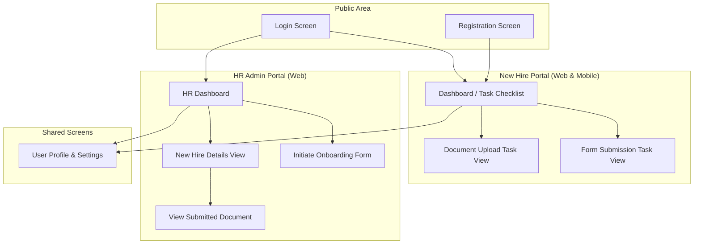
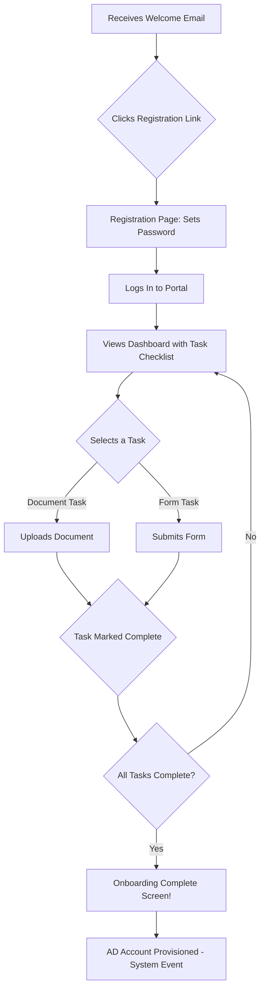
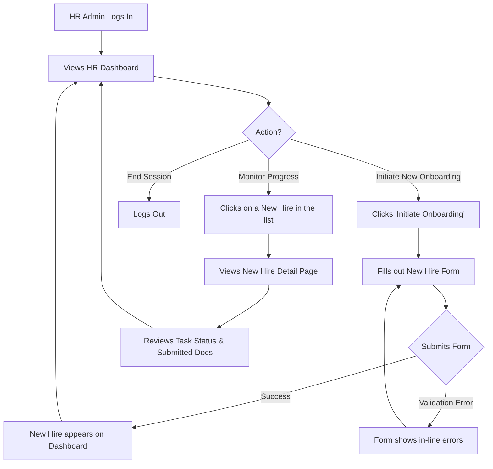

### **Employee Onboarding System UI/UX Specification**

#### **Introduction**

This document defines the user experience goals, information architecture, user flows, and visual design specifications for the Employee Onboarding System's user interface. It serves as the foundation for visual design and frontend development, ensuring a cohesive and user-centered experience.

##### **Overall UX Goals & Principles**

**Target User Personas:**
*   **The New Hire:** A tech-savvy professional who expects a guided, efficient, and seamless experience, primarily on mobile devices.
*   **The HR Admin:** A power user who requires a productive, dashboard-centric interface to manage multiple onboarding processes simultaneously and track compliance.
*   **The IT Admin:** A stakeholder who relies on clear, automated notifications from the system to perform their tasks without manual intervention.

**Usability Goals:**
*   **Efficiency:** Users can complete their core tasks (e.g., submitting a document, checking a status) in the minimum number of steps.
*   **Clarity:** The interface is self-explanatory, providing clear instructions and feedback at every stage of the process.
*   **Satisfaction:** The design is aesthetically pleasing, professional, and frustration-free, leading to high user satisfaction.

**Design Principles:**
1.  **Clarity First:** Prioritize clear, unambiguous language and intuitive navigation over purely aesthetic choices.
2.  **Guided Journeys:** Proactively guide users through complex processes, always making the next step obvious.
3.  **Efficiency by Default:** Design workflows to be as short and streamlined as possible.
4.  **Consistency is Key:** Use consistent UI patterns and terminology across the web and mobile platforms to create a predictable experience.
5.  **Accessible by Design:** Ensure the application is usable by people with the widest possible range of abilities.

##### **Change Log**
| Date | Version | Description | Author |
| :--- | :--- | :--- | :--- |
| 2025-08-19 | 1.0 | Initial draft of the UI/UX Specification. | Sally, UX Expert |

#### **Information Architecture (IA)**

##### **Site Map / Screen Inventory**

This diagram shows the primary screens of the application and how they relate to each other.

##### **Navigation Structure**

*   **Primary Navigation (HR Admin - Web):** A persistent vertical sidebar on the left will provide access to the main sections: "Dashboard," "Settings," and "Logout." This keeps key actions always visible for our power users.
*   **Primary Navigation (New Hire - Web):** A simple, clean header will contain links to "My Dashboard," "My Profile," and "Logout." This keeps the focus on the new hire's primary tasks.
*   **Primary Navigation (New Hire - Mobile):** A native tab bar at the bottom of the screen will provide access to the most important views: "Dashboard," "Profile," and "Settings." This is a standard and intuitive pattern for mobile apps.
*   **Breadcrumb Strategy:** For any screen that is more than one level deep (e.g., HR Dashboard > New Hire Details), a breadcrumb trail will be displayed at the top of the page to provide context and easy one-click navigation back to parent pages.

#### **User Flows**

##### **Flow: New Hire Onboarding**

**User Goal:** To successfully complete all required onboarding tasks and feel prepared and welcomed before their first day.

**Entry Points:** The user clicks the unique registration link in the welcome email sent by HR.

**Success Criteria:** The new hire has a "Completed" status in the system, all their documents and forms are submitted, and their Active Directory account has been provisioned.

**Flow Diagram:**

**Edge Cases & Error Handling:**
*   **Expired/Used Registration Link:** If the user clicks an invalid link, they will see a page explaining the link has expired and instructing them to contact HR for a new one.
*   **Forgot Password:** The login screen will include a standard "Forgot Password" flow.
*   **Document Upload Failure:** If a file upload fails (e.g., wrong file type, size limit exceeded), the system will display a clear, specific error message in-line.
*   **Form Validation Error:** If a form is submitted with invalid data, the problematic fields will be highlighted with clear, descriptive error messages.
*   **Session Timeout:** If a user's session expires, they will be redirected to the login page. Upon logging back in, they will be returned to the last screen they were on.

##### **Flow: HR Admin Initiates & Monitors Onboarding**

**User Goal:** To easily start the onboarding process for a new hire and to track the status of all new hires in a centralized location.

**Entry Points:** The HR Admin logs into the web portal.

**Success Criteria:** A new hire is successfully added to the system and their status is visible on the dashboard. The HR Admin can, at any time, view the detailed task-level progress of any new hire.

**Flow Diagram:**

**Edge Cases & Error Handling:**
*   **Duplicate Email Address:** If an HR Admin tries to initiate onboarding for an email address that already exists in the system, a clear error message will be shown, preventing the creation of a duplicate record.
*   **Welcome Email Failure:** If the welcome email to the new hire fails to send for any reason, the system will log the error and provide a "Resend Welcome Email" button on the new hire's detail page for the HR Admin.
*   **Data Loading Failure:** If the dashboard data fails to load, a user-friendly error message will be displayed with a "Retry" button.
*   **Permissions Error:** If an HR Admin attempts an action for which they do not have permission, a clear and professional "Access Denied" message will be shown.

#### **Wireframes & Mockups**

**Primary Design Files:** The primary high-fidelity visual designs and interactive prototypes will be created and maintained in **Figma**. 
(Link to Figma Project: [Placeholder - To be added once project is created])

---

##### **Key Screen Layout: Login Screen**
*   **Purpose:** To allow both New Hires and HR Admins to securely access the platform.
*   **Key Elements:**
    *   FPT Logo (centered at top)
    *   Heading: "Welcome to the Onboarding Portal"
    *   Input Field: "Email Address"
    *   Input Field: "Password"
    *   Button: "Login" (Primary Action)
    *   Link: "Forgot Password?"
*   **Interaction Notes:** The "Login" button will be disabled until both email and password fields are filled.

---

##### **Key Screen Layout: HR Admin Dashboard**
*   **Purpose:** To provide HR admins with a centralized view to manage and monitor all new hires.
*   **Key Elements:**
    *   **Header:** FPT Logo, User Profile/Logout menu.
    *   **Sidebar Navigation:** Links to "Dashboard" and "Settings."
    *   **Main Content Area:**
        *   Title: "New Hires Dashboard"
        *   Button: "Initiate Onboarding" (Primary Action)
        *   Data Table: A list of new hires with columns for "Name," "Start Date," and "Status." Table headers will allow for sorting. A search bar will be present to filter the list by name.
*   **Interaction Notes:** Clicking on a row in the new hire table will navigate the admin to that new hire's detail page.

---

##### **Key Screen Layout: New Hire Dashboard (Web & Mobile)**
*   **Purpose:** To provide new hires with a clear, guided checklist of their onboarding tasks.
*   **Key Elements:**
    *   **Header/Tab Bar:** FPT Logo, User Profile/Logout access.
    *   **Welcome Message:** "Welcome, [User Name]! Here are your next steps."
    *   **Onboarding Checklist:** A vertically stacked list of task items. Each item will display:
        *   Task Title (e.g., "Upload Signed Offer Letter")
        *   Due Date
        *   Status Icon (e.g., To-Do, In Progress, Complete)
*   **Interaction Notes:** Tapping/clicking a task will navigate the user to the specific screen for that task. Completed tasks will be visually distinct (e.g., greyed out with a checkmark).

---

##### **Key Screen Layout: Document Upload View (Web & Mobile)**
*   **Purpose:** To allow a new hire to securely upload a required document.
*   **Key Elements:**
    *   **Page Title:** Clearly states the required document (e.g., "Upload Signed Offer Letter").
    *   **Instructions:** A brief description of the requirements (e.g., "Please upload a PDF, JPG, or PNG file, max 5MB").
    *   **File Dropzone:** A large, clearly marked area where a user can drag and drop a file, or click to open a file selector.
    *   **Button:** "Upload Document"
*   **Interaction Notes:** The "Upload Document" button is disabled until a valid file is selected. A progress indicator will be shown during the upload. A clear success or error message will be displayed after the upload attempt.

#### **Component Library / Design System**

##### **Design System Approach**

We will adopt a hybrid approach. Our foundation will be the **`shadcn/ui`** component library, which provides a set of accessible, unstyled components. We will then apply our custom FPT branding and styles using **`Tailwind CSS`**. For any UI elements not available in `shadcn/ui`, we will create our own reusable components. This strategy gives us a massive head start on development while ensuring the final product has a unique and fully branded look and feel.

---

##### **Core Components**

*   **Component: Button**
    *   **Purpose:** To trigger all primary and secondary user actions.
    *   **Variants:** Primary (e.g., "Login," "Submit"), Secondary (e.g., "Cancel"), Destructive (e.g., "Delete").
    *   **States:** Default, Hover, Focused, Disabled, Loading.

*   **Component: Input Field**
    *   **Purpose:** To collect user input in forms.
    *   **Variants:** Text, Email, Password, Search.
    *   **States:** Default, Focused, Error, Disabled.

*   **Component: Data Table**
    *   **Purpose:** To display the list of new hires on the HR Dashboard.
    *   **Features:** Sortable columns, Search/Filter functionality.
    *   **States:** Loading, Empty State (when no data is present), With Data.

*   **Component: Task Item**
    *   **Purpose:** To display a single task in the new hire's checklist.
    *   **Variants:** To-Do, In Progress, Completed. Each will have a distinct visual style (e.g., icon, color).
    *   **States:** Default, Hover.

*   **Component: File Uploader**
    *   **Purpose:** To allow users to select and upload documents.
    *   **Features:** Drag-and-drop functionality, file type and size validation.
    *   **States:** Default, File Selected, Uploading (with progress indicator), Success, Error.

*   **Component: Modal / Dialog**
    *   **Purpose:** To display contextual forms or information without navigating away from the current page (e.g., the "Initiate Onboarding" form).
    *   **Variants:** Standard, Confirmation Dialog.

#### **Branding & Style Guide**

##### **Visual Identity**
*   **Brand Guidelines:** The core visual identity is driven by the FPT logo. The overall aesthetic must be clean, professional, and modern, reflecting the brand's image.

##### **Color Palette**
| Color Type | Hex Code | Usage |
| :--- | :--- | :--- |
| Primary | `#0D47A1` | Main buttons, links, active navigation |
| Secondary | `#F37F21` | Secondary actions, highlights, callouts |
| Accent | `#4CAF50` | Icons, success states, positive feedback |
| Success | `#4CAF50` | Confirmation messages, success notifications |
| Warning | `#FFC107` | Warnings, important notices |
| Error | `#D32F2F` | Error messages, destructive action confirmation |
| Neutral | `#111827` to `#F9FAFB` | Body text, headings, borders, backgrounds |

##### **Typography**
*   **Font Families:**
    *   **Primary:** `Inter` (A clean, modern, and highly readable sans-serif font, available via Google Fonts).
    *   **Monospace:** `Roboto Mono` (For any instances where code or tabular data needs to be displayed).
*   **Type Scale:**
| Element | Size | Weight |
| :--- | :--- | :--- |
| H1 | 36px | 700 (Bold) |
| H2 | 28px | 700 (Bold) |
| H3 | 22px | 600 (Semi-bold) |
| Body | 16px | 400 (Regular) |
| Small | 14px | 400 (Regular) |

##### **Iconography**
*   **Icon Library:** We will use the **Lucide** icon library. It offers a comprehensive set of clean, modern icons that are designed to work perfectly with Tailwind CSS.

##### **Spacing & Layout**
*   **Grid System:** We will use an **8-point grid system**. All spacing and component dimensions will be in increments of 8px (e.g., 8px, 16px, 24px, 32px). This ensures consistent and harmonious layouts.

#### **Accessibility Requirements**

##### **Compliance Target**
*   **Standard:** The application will adhere to the **Web Content Accessibility Guidelines (WCAG) 2.1 at the Level AA** conformance level. This is a globally recognized standard that ensures a high degree of usability for people with disabilities.

##### **Key Requirements**

*   **Visual:**
    *   **Color Contrast:** All text will have a contrast ratio of at least 4.5:1 against its background to be readable for users with low vision.
    *   **Focus Indicators:** All interactive elements (links, buttons, form fields) will have a clear and highly visible focus indicator when navigated to via a keyboard.
    *   **Text Resizing:** Users will be able to resize text up to 200% in their browser without breaking the layout or losing functionality.

*   **Interaction:**
    *   **Keyboard Navigation:** All functionality will be operable using only a keyboard, in a logical and predictable order.
    *   **Screen Reader Support:** The application will be compatible with modern screen readers (e.g., NVDA, VoiceOver, TalkBack), with all elements, images, and controls properly labeled with ARIA attributes where necessary.
    *   **Touch Targets:** On mobile devices, all interactive elements will have a touch target size of at least 44x44 pixels to be easily tappable.

*   **Content:**
    *   **Alternative Text:** All meaningful images will have descriptive alt text.
    *   **Heading Structure:** Pages will use a logical and semantic heading structure (H1, H2, H3, etc.) to organize content.
    *   **Form Labels:** All form inputs will have clear, programmatically associated labels.

##### **Testing Strategy**
Accessibility will be an integral part of our development and testing process. We will use a combination of:
1.  **Automated Tools:** Using tools like Axe and Lighthouse in our CI/CD pipeline to catch common issues.
2.  **Manual Testing:** Regularly performing keyboard-only navigation and screen reader testing.
3.  **Component-level Checks:** Ensuring that our core components from the design system are built with accessibility in mind from the start.

#### **Responsiveness Strategy**

*   **Breakpoints:**
| Breakpoint | Min Width | Target Devices |
| :--- | :--- | :--- |
| Mobile | 320px | Smartphones |
| Tablet | 768px | Tablets, small laptops |
| Desktop | 1024px | Standard desktop monitors |
| Wide | 1440px | Large desktop monitors |

*   **Adaptation Patterns:** The layout will be fluid and adapt to the screen size. On mobile, it will use a single-column layout for clarity. On tablets and desktops, it will expand to multi-column layouts where appropriate (e.g., the HR Dashboard). Navigation will transform from a mobile tab bar to a sidebar/header on larger screens.

---

#### **Animation & Micro-interactions**

*   **Motion Principles:** Animations will be subtle, purposeful, and used to provide feedback or guide the user's attention. We will avoid purely decorative animations that could distract the user or impact performance.
*   **Key Animations:**
    *   **State Changes:** Smooth transitions (e.g., fade) for hover and focus states on interactive elements.
    *   **Loading Indicators:** Subtle loading spinners or skeleton screens will be used to provide feedback when data is being fetched.
    *   **Page Transitions:** A simple, fast fade transition between page loads to create a smoother feel.

---

#### **Performance Considerations**

*   **Performance Goals:**
    *   **Page Load:** Core Web Vitals (LCP) under 2.5 seconds.
    *   **Interaction Response:** All interactions (e.g., button clicks) should provide feedback in under 100ms.
    *   **Animation FPS:** All UI animations must maintain a consistent 60 frames per second.
*   **Design Strategies:** We will optimize all images, lazy-load off-screen content, and use efficient CSS for animations to ensure a fast, responsive experience.

---

#### **Next Steps**

*   **Immediate Actions:**
    1.  Secure formal sign-off on this complete UI/UX Specification.
    2.  Begin creating high-fidelity mockups and interactive prototypes in Figma based on these specifications.
    3.  Handoff this document to the Architect to inform the detailed front-end architecture design.
*   **Design Handoff Checklist:**
    *   [x] All user flows documented
    *   [x] Component inventory complete
    *   [x] Accessibility requirements defined
    *   [x] Responsive strategy clear
    *   [x] Brand guidelines incorporated
    *   [x] Performance goals established
